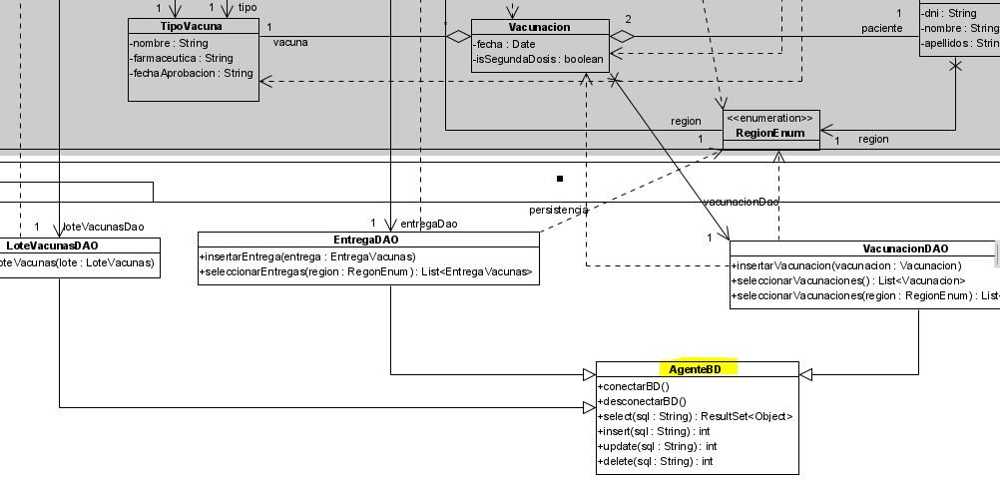
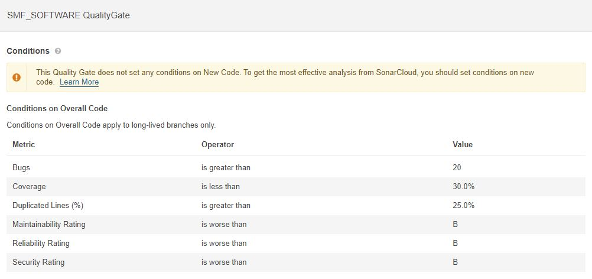

# Memoria Proyecto Ingeniería del Software II - SMF_Software

---

## Miembros de la empresa:

---

    • Marcelino Díaz Alba
    • Sergio Díaz de la Peña
    • Fernando Guerrero Cano

---

## Gestión de la configuración

---

### Plan de Gestión de la Configuración

---

#### Introducción

---

##### Proposito del plan

---

Este documento describe las actividades de gestión de configuración de software que deben
ser llevadas a cabo durante el proceso de desarrollo de nuestro proyecto. Aquí se definen tanto los
productos que se pondrán bajo control de configuración como los procedimientos que deben
ser seguidos por los integrantes del equipo de trabajo.

---

##### Alcance del plan

---

El Plan de configuración está basado en algunos supuestos que se detallarán:

El tiempo de duración del proyecto está limitado a 3 meses, por lo tanto se busca
una rápida respuesta a los cambios.

El Modelo de Proceso se basa en un desarrollo incremental, dado por las distintas
iteraciones. Resulta importante tener control sobre cada una de las iteraciones y
fases, de los productos generados en estas y de los cambios surgidos, evaluados y
aprobados.

---

##### Terminos clave

---

    • CCB (Configuration Control Board) Comité de Control de Configuración.
    • CI (Configuration Item) elemento bajo gestión de Configuración.
    • SCA (Software Change Authorization) Autorización de Cambio en el Software.
    • SCM (Software Configuration Management) Gestión de Configuración del Software.
    • SCMR (SCM Responsible) Responsable de SCM.
    • SCR (System/Software Change Request) Petición de Cambio en el Sistema/Software.
    • SQA (Software Quality Assurance) Aseguramiento de la Calidad del Software.
    • SQAR (SQA Responsible) Responsable de SQA.
    • VR (Verification Responsible) Responsable de verificación.

---

### Uso de Maven

---

Hemos hecho uso de la herramienta Maven para desarrollar y automatizar el manejo de la creación del 
formato de carpeta original, realizando el surtido y las pruebas y el empaquetado y despliegue de la 
salida final.

Tambien hemos utilizado Maven para gestionar las dependencias de nuestro proyecto.

Lo hemos usado para crear la infraestructura de nuestro proyecto.

El uso de Maven nos ha ayudado a:

    • Construcciones (Builds)
    • Documentación
    • Informes
    • Dependencias
    • Configuración del Software
    • Publicaciones (Releases)

---

## Planificación y gestión

---

Hemos llevado a cabo una metodología agil llamada Scrum. Esta es una metodologia de Gestión de Proyectos.

Esta ha sido adaptada a nuestro equipo de trabajo con el objetivo de obtener resultados rapidos y adaptandose a las peticiones de cambios del cliente.

Por un lado, encontramos el Product Backlog en el cual hay un listado de las Historias de usuario que se incorporarán al producto software mediante incrementos.

De este Product Backlog obtenemos el Sprint Backlog como el subconjunto de 
historias de usuarios a desarrollar en el sprint.

Por otro lado, tenemos la sección In progress que se trata en las tareas del Sprint Backlog que estan siendo llevadas a cabo en ese momento.

Por último, tenemos la sección Done, en esta se encuentran las tareas que han sido completadas.

A lo largo de esta primera etapa de desarrollo, hemos llevado a cabo varios sprints de una duración media de 2 semanas.

Hemos realizado varias reuniones de planificacion, para determinar los elementos que iba a contener el Product Backlog y para la creación del Sprint Backlog. A su vez, diariamente hemos realizado una breve reunión. 
Por último, al finalizar cada Sprint nos hemos reunido nuevamente para comentar sobre las tareas realizadas durante el Sprint...

A continuación, se muestra un ejemplo del uso del Produck Backlog, Sprint Backlog, In progress y Done. Haciendo uso de la metodología Scrum

---

# Codificación

---

A continuación, se muestran los bocetos realizados para llevar a cabo el desarrollo de la UI.

---

PantallaPrincipal:

---

PantallaConsultarEstadisticas:

---

PantallaSistemaSaludNacional:

---

PantallaSistemaSaludRegional:

---

Respecto al diagrama UML hemos ralizado los siguientes cambios:

---

Por un lado en la clase GestorVacunacion en el metodo altaEntregaVacunas hemos añadido un nuevo parametro llamado Region el cual es de tipo String, como se muestra a continuación:

---

Por otro lado, hemos eliminado la clase AbstractEntityDAO<E> y las generalizaciones que habia con las clases LoteVacunasDAO, EntregaDAO y VacunacionDAO las hemos dirigido a la clase AgenteBD, se muestra a continuación:

## Generación de calidad

Hemos realizado la configuración en SonarCloud siguiendo el pdf de la práctica 3 'P3.Sonar'. Para ello hemos añadido las siguientes propiedades a nuestro fichero pom, las cuales son las siguientes:
	
	<sonar.organization>smfsoftware</sonar.organization>
	
	<sonar.host.url>https://sonarcloud.io</sonar.host.url>
	
	<sonar.sources>./src/main/java</sonar.sources>
	
	<sonar.binaries>./target/classes</sonar.binaries>
    
Después de haber configurado nuestro proyecto con SonarCloud hemos ejecutado un análisis desde Maven, para esto desde Eclipse hemos ejecutado lo siguiente:
        
	mvn verify sonar:sonar
	
Una vez terminada la ejecución del análisis, nos muestra los siguientes resultados, los cuales nos los divide en 6 diferentes apartados:
	
	RELIABILITY
	
	MAINTAINABILITY
	
	SECURITY
	
	SECURITY REVIEW
	
	COVERAGE
	
	DUPLICATIONS

Por un lado, SonarCloud nos genera por defecto una QualityGate, por ejemplo el Coverage por defecto viene definido a un 80% y Security Hotspots Reviewed viene fijado a un 100%. 
	
A continuación se muestra lo nombrado:
	

	
Sin embargo, nosotros hemos configurado un QualityGate especifico para nuestro proyecto, el cual hemos llamado "SMF_SOFTWARE QualityGate". 
	
De esta nueva QualityGate tenemos que destacar que hemos eliminado el apartado Security Hotspots Reviewed, también el Coverage lo hemos bajado de un 80% (que era el valor por defecto) a un 30%. 
	
Hemos añadido un nuevo apartado que hace referencia a los Bugs y hemos puesto el valor de 20. 
	
Por último, en cuanto al Duplicated Lines (%) lo hemos subido de un 3% a un 25%. 
	
A continuación, se observa lo comentado en este punto:

	
En cuanto a la integración del análisis en SonarCloud con cada uno de los commit que hagamos en GitHub para asegurar la integración/mejora continua 
	
---

## Gestión de mantenimiento
	
La mantenibilidad de un producto de software es la capacidad de un producto de software de ser modificado. Estas modificaciones incluyen correcciones, mejoras, o adaptaciones a cambios en el entorno, los requisitos o las especificaciones funcionales.
	
Hemos llevado a cabo un plan de mantenimiento preventido utilizando SonarCloud. 
	
Este tipo de mantenimiento es aquel que surge de la necesidad de rebajar el correctivo y todo lo que representa. Pretende reducir la reparación mediante una rutina de inspecciones periódicas y la renovación de los elementos dañados.
	

	
	
---

